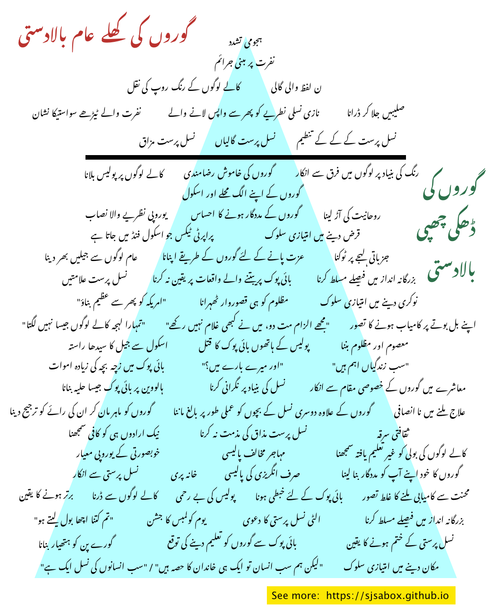

# Anti-Blackness & White Supremacy Terms - Urdu Translations
These are the Urdu translations for the popular White Supremacy 🔺 graphic featuring a set of 67 terms that describe overt &amp; covert forms of racism. The Urdu translations are accompanied by their English transliterations, and some handy links to articles and other media that explain or are references for each concept. (For other languages, please visit our [homepage](https://sjsabox.github.io).)

### [Urdu Graphic](img/Urdu.png) | [Urdu Transliterated Graphic](img/Urdu%20Transliteration.png) | [Original Graphic](img/Original.png)

   

## Terms, Translations, Transliterations, Expanded Explanations, Reference Links

Below, each term is translated individually in the Nastaliq script for Urdu, then transliterated into English for easier reading. Some terms may also have an 📌 expanded definition for contextualization or clarifications of the shorter translation. Where appropriate, links 🔗 have been added that offer general explanations or examples where these issues directly effect BIPOC, or specifically South Asians.

## Overt White Supremacy - goroN ki khule aam baladasti   گوروں کی کھلے عام بالادستی

### 1. Lynching 
hujoomi tashaddud - ہجومی تشدد 

📌 Expanded Explanation: 
qanooni ikhtiyar ke baghair maarna - قانونی اختیار کے بغیر مارنا 

🔗 References:

[“The oppression doesn’t end, it adapts”](https://www.vox.com/21295670/robert-fuller-malcolm-harsch-hanging-history-lynching) 

[Terror Lynching in America](https://www.youtube.com/watch?v=aS61QFzk2tI) 

[ہجومی تشدد](https://ur.wikipedia.org/wiki/ہجومی_تشدد)

#

### 2. Hate crimes
nafrat par mabni jaraim - نفرت پر مبنی جرائم

📌 Expanded Explanation: 
nasl ki buniyad par zulm karna - نسل کی بنیاد پر ظلم کرنا

🔗 References:

[Hate Crimes Explained](https://www.splcenter.org/20180415/hate-crimes-explained)

[Black Americans still are victims of hate crimes more than any other group](https://publicintegrity.org/politics/black-americans-still-are-victims-of-hate-crimes-more-than-any-other-group/)

[نفرت پر مبنی جرائم میں اضافہ، جنوبی ایشیائی امریکیوں میں تشویش](https://www.urduvoa.com/a/concerns-over-hate-crime-in-south-asian-communities-in-us/3781461.html)

#

### 3. Blackface
kale logoN ke rang roop ki naql - کالے لوگوں کے رنگ روپ کی نقل	

🔗 References:

[Why is Blackface Offensive](https://www.vox.com/2014/10/29/7089591/why-is-blackface-offensive-halloween-costume)

[Blackface, Staple of Arab Comedy](https://www.nytimes.com/2019/08/18/world/middleeast/blackface-arab-tv-racist.html)

[Brownface at Bon Appetit](https://www.insider.com/bon-appetit-editor-adam-rapoport-resigned-dressed-puerto-rican-photo-2020-6)

[جسٹن ٹروڈو: کینیڈا کے وزیراعظم نے 2001 میں پارٹی میں ’براؤن فیس‘ والی تصویر کھنچوانے پر معافی مانگ لی](https://www.bbc.com/urdu/world-49752360)

#

### 4. The N-word
noon lafz wali gaali - ن لفظ والی گالی

🔗 References:

[When Latinx People Use the N-Word](https://www.nytimes.com/2019/10/17/opinion/gina-rodriguez-n-word-latinx.html)

[BBC apologizes for use of N-word in news report](https://www.cnn.com/2020/08/10/media/bbc-apology-offensive-language-scli-intl-gbr/index.html)

#

### 5. Swastikas
nafrat wale TeRhe swastika nishaan - نفرت والے ٹیڑھے سواستیکا نشان	

📌 Expanded Explanation: 
nafrat-angez nasli bartari ke TeRhi saleebon ke nishan - نفرت انگیز نسلی برتری کے ٹیڑھی صلیبوں کے نشان

🔗 References:

[فن لینڈ فضائیہ نے ایک صدی بعد اپنے علامتی نشان سے سواستیکا ہٹا دیا](https://www.dw.com/ur/فن-لینڈ-فضائیہ-نے-ایک-صدی-بعد-اپنے-علامتی-نشان-سے-سواستیکا-ہٹا-دیا/a-54021041)

#

### 6. Neo-Nazis
Nazi nasli nazariye ko phir se wapas lane wale - نازی نسلی نطریے کو پھر سے واپس لانے والے	

🔗 References:

[نازی نسلی نظریات](https://encyclopedia.ushmm.org/content/ur/article/victims-of-the-nazi-era-nazi-racial-ideology)

#

### 7. Burning Crosses
saleebeN jala kar Darana - صلیبیں جلا کر ڈرانا

🔗 References:

[A Decision on Cross Burning](https://www.nytimes.com/2003/04/08/opinion/a-decision-on-cross-burning.html)

[Virginia Man Accused of Burning Cross on Lawn of Black Teen Protest Organizer](https://www.nbcwashington.com/news/local/virginia-man-charged-in-connection-with-cross-burning/2345942/)

[Authorities investigate cross burning in Alabama](https://thehill.com/homenews/state-watch/501477-authorities-investigate-cross-burning-in-alabama)

#

### 8. Racist Jokes
nasl-parast mazaaq - نسل پرست مزاق	

🔗 References:

[She didn’t laugh at racist jokes. Her coach said she didn’t have the right ‘chemistry’ for the team.](https://www.washingtonpost.com/local/public-safety/student-refuses-to-let-the-bullies-win/2017/04/24/623187e4-1ba1-11e7-bcc2-7d1a0973e7b2_story.html)

[Asian American racism is the unfunny joke the comedy world needs to reckon with](https://www.vox.com/the-highlight/2020/1/15/21065939/comedy-racism-asian-american-rosie-odonnell-shane-gillis-awkwafina-ali-wong)

#

### 9. Racial Slurs
nasl-parast gaaliyaN - نسل پرست گالیاں

🔗 References:

#

### 10. KKK
nasl-parast kkk tanzeem - نسل پرست کے کے کے تنظیم

📌 Expanded Explanation: 
gore logoN ki dhauNs jamaane wali mujrimana tanzeem - گورے لوگوں کی دھونس جمانے والی مجرمانہ تنظیم

🔗 References:

[Ku Klux Klan](https://www.splcenter.org/fighting-hate/extremist-files/ideology/ku-klux-klan)

#

## Covert White Supremacy - goroN ki Dhaki chhupi baladasti   گوروں کی ڈھکی چھپی بالادستی  

### 11. Calling the Police on Black People	
kale logoN par police bulaana - کالے لوگوں پر پولیس بلانا	

📌 Expanded Explanation: 
police bulana kale logoN ki zindagi ke liye khatarnak hai, kyunke police ka bartao nasl-parast ho sakta hai  
پولیس بلانا کالے لوگوں کی زندگی کے لئے خطرناک ہے کیونکہ پولیس کا برتاؤ نسل پرست ہو سکتا ہے

🔗 References:

[Why Did Cup Foods Call the Cops on George Floyd?](https://www.nytimes.com/2020/06/17/opinion/george-floyd-arab-muslims-racism.html)

[White woman who called police on a black man bird-watching in Central Park has been fired](https://www.cnn.com/2020/05/26/us/central-park-video-dog-video-african-american-trnd/index.html)

#

### 12. White Silence	
goroN ki khamosh razamandi - 	گوروں کی خاموش رضامندی	

📌 Expanded Explanation: 
goroN ka nasl parasti ko nazar andaaz karna - گوروں کا نسل پرستی کو نظر انداز کرنا

🔗 References:

[Why white silence is deafening — and deadly](https://www.salon.com/2020/05/31/why-white-silence-is-deafening-and-deadly/)

[Black mother explains why white silence is so painful](https://www.youtube.com/watch?v=RwZKU4wUeKs)

#

### 13. Colorblindness	
rang ki buniyad par logoN maiN farq se inkar -	رنگ کی بنیاد پر لوگوں میں فرق سے انکار

📌 Expanded Explanation: 
maashre maiN rang ki buniyad par farq hone ke bawjood ye maanna ke sab rang baraabar haiN -  
معاشرے میں رنگ کی بنیاد پر فرق ہونے کے باوجود یہ ماننا کہ سب رنگ برابر ہیں 

🔗 References:

[White parents teach their children to be colorblind. Here’s why that’s bad for everyone](https://www.washingtonpost.com/nation/2018/10/05/white-parents-teach-their-children-be-colorblind-heres-why-thats-bad-everyone/)

#

### 14. White Parents Self-Segregating Neighborhoods & Schools	
goroN ke apne alag mahalle aur school -	گوروں کے اپنے الگ محلے اور اسکول	

📌 Expanded Explanation: 
🔗 References:

[White America is quietly self-segregating](https://www.vox.com/2017/1/18/14296126/white-segregated-suburb-neighborhood-cartoon)

[Despite the Best Intentions: How Racial Inequality Thrives in Good Schools](https://bookshop.org/books/despite-the-best-intentions-how-racial-inequality-thrives-in-good-schools/9780190669829)

#

### 15. Eurocentric Curriculum	
Europi nazariye wala nisaab -	یوروپی نظریے والا نصاب	

📌 Expanded Explanation: 
sirf Europi nazariye hi ko paRhana - صرف یورپی نظریے ہی کو پڑھانا  

🔗 References:

[How US history is whitewashed in high school exams](https://www.aljazeera.com/indepth/opinion/history-whitewashed-high-school-exams-190701132525633.html)

[History Class & Fictions About Race](https://www.theatlantic.com/education/archive/2015/10/the-history-class-dilemma/411601/)

#

### 16. White Savior Complex	
goroN ke madadgaar hone ka ehsaas -	گوروں کے مددگار ہونے کا احساس	

🔗 References:

[The White Savior Industrial Complex](https://www.theatlantic.com/international/archive/2012/03/the-white-savior-industrial-complex/254843/)

[Can Outsiders Make Films About India in an Honest Way?](https://www.kqed.org/arts/11483013/can-outsiders-make-films-about-india-in-an-honest-way)

#

### 17. Spiritual Bypassing	
ruhaniyat ki aaR lena -	روحانیت کی آڑ لینا

📌 Expanded Explanation: 
ruhani aur mazhabi batoN ki aaR le kar haqeeqi masaail se tawajjo haTaana
روحانی اور مذہبی باتوں کی آڑ لے کر حقیقی مسائل سے توجہ ہٹانا

🔗 References:

[Spiritual Bypassing, White Privilege and BlackLivesMatter](https://medium.com/@lilyayre/spiritual-bypassing-white-privilege-and-blacklivesmatter-531db2c8c85c)
#

### 18. Education Funding from Property Taxes	
Property tax jo school fund maiN jata hai -	پراپرٹی ٹیکس جو اسکول فنڈ میں جاتا ہے	

📌 Expanded Explanation: 
ghareeb ilaqoN se kam property tax aane ki wajah se wahan ke schoolon ko kam fund milna  
غریب علاقوں سے کم پراپرٹی ٹیکس آنے کی وجہ سے وہاں کے اسکولوں کو کم فنڈ ملنا

🔗 References:

[Report finds $23 billion racial funding gap for schools](https://www.washingtonpost.com/local/education/report-finds-23-billion-racial-funding-gap-for-schools/2019/02/25/d562b704-3915-11e9-a06c-3ec8ed509d15_story.html)

[EdBuild - Clean Slate](https://edbuild.org/content/clean-slate)

#

### 19. Discriminatory Lending	
qarz dene maiN imtiazi sulook -	قرض دینے میں امتیازی سلوک	

🔗 References:

[Wells Fargo accused of preying on black and Latino homebuyers in California](https://money.cnn.com/2018/02/27/investing/wells-fargo-sacramento-lawsuit-discriminatory-lending/index.html)

[How Some Algorithm Lending Programs Discriminate Against Minorities](https://www.npr.org/2018/11/24/670513608/how-some-algorithm-lending-programs-discriminate-against-minorities)

#

### 20. Mass Incarceration	
aam logoN se jaileN bhar dena -	عام لوگوں سے جیلیں بھر دینا

📌 Expanded Explanation: 
maamuli baatoN par lambe arse ke liye jail main Daal dene ka aam riwaj - معمولی باتوں پر لمبے عرصے کے لئے جیل میں ڈال دینے کا عام رواج

🔗 References:

[ACLU - Mass Incarceration](https://www.aclu.org/issues/smart-justice/mass-incarceration)

[How We Misunderstand Mass Incarceration](https://www.newyorker.com/magazine/2017/04/10/how-we-misunderstand-mass-incarceration)

#

### 21. Respectability Politics
izzat paane ke liye goroN ke tareeqe apnana -	عزت پانے کے لئے گوروں کے طریقے اپنانا	

🔗 References:

[Systemic Racism Couldn’t Care Less About Your Respectability Politics](https://www.thenation.com/article/archive/systemic-racism-could-care-less-about-your-respectability-politics/)
#

### 22. Tone Policing	
jazbaati lehje par Tokna - جزباتی لہجے پر ٹوکنا 	

🔗 References:

[Tone policing is a little-known microaggression that's common in the workplace — here's how to identify it](https://www.businessinsider.com/how-to-identify-and-help-stop-tone-policing-in-workplace-2020-8) 

#

### 23. Racist Mascots	
nasl-parast alaamateN -	نسل پرست علامتیں	

🔗 References:

[Washington’s NFL team is finally rid of its racist name — 50 years late](https://www.washingtonpost.com/opinions/washingtons-nfl-team-is-finally-rid-of-its-racist-name--50-years-late/2020/07/13/aca3e2ce-c538-11ea-b037-f9711f89ee46_story.html)

[Food Brands Are Finally Changing Their Racist Mascots—But Is It Enough?](https://www.delish.com/food/a33313212/food-brands-racist-mascots-logos/)

[15 racist brands, mascots, and logos that were considered just another part of American life](https://www.businessinsider.com/15-racist-brand-mascots-and-logos-2014-6)

#

### 24. Not Believing Experieces of BIPOC	
BIPOC par beetne wale waqeyaat par yaqeen na karna -	بائی پوک پر بیتنے والے واقعات پر یقین نہ کرنا	

📌 Expanded Explanation: 
BIPOC = kaale, qabaili, ya jo goroN ke alawa doosri nasl ke hoN -  
بائی پوک = کالے، قبائلی، یا جو گوروں کے علاوہ دوسری نسل کے ہوں

🔗 References:

#

### 25. "Make America Great Again"	
"Amreeka ko phir se azeem banao" -	"امریکہ کو پھر سے عظیم بناؤ"	

🔗 References:

#

### 26. Blaming the Victim	
mazloom ko hi qusoor-waar Thehrana -	مظلوم کو ہی قصوروار ٹھہرانا	

🔗 References:

[Black doesn’t mean criminal. Conservatives should know that by now.](https://www.washingtonpost.com/outlook/2020/05/18/ahmaud-arbery-conservatives-reaction/)

[Stop Blaming Black People For Dying of Coronavirus](https://www.theatlantic.com/ideas/archive/2020/04/race-and-blame/609946/)

#

### 27. Hiring Discrimination	
naukri dene maiN imtiazi sulook -	نوکری دینے میں امتیازی سلوک	

🔗 References:

[Workplace discrimination is illegal. But our data shows it’s still a huge problem.](https://www.vox.com/policy-and-politics/2019/2/28/18241973/workplace-discrimination-cpi-investigation-eeoc)

['We Have A Black People Problem': Facebook Worker Claims Racial Discrimination](https://www.npr.org/2020/07/02/886544638/we-have-a-black-people-problem-facebook-worker-claims-racial-discrimination)

[Dear White Boss](https://hbr.org/2002/11/dear-white-boss)

#

### 28. "You don't sound Black"	
"tumhara lehja kale logoN jaisa nahiN lagta" -	"تمہارا لہجہ کالے لوگوں جیسا نہیں لگتا"	

🔗 References:

['You're So Articulate': Why Microaggressions Wear People Down](https://www.kuow.org/stories/youre-so-articulate-why-microaggressions-wear-people-down)

#

### 29. "Don't BLame Me, I Never Owned Slaves"	
"mujhe ilzaam mat do, maiN ne kabhi ghulaam nahiN rakhe" -	"مجھے الزام مت دو، میں نے کبھی غلام نہیں رکھے"	

🔗 References:

#

### 30. Bootstrap Theory	
apne bal boote par kamyab hone ka tasavvur -	اپنے بل بوتے پر کامیاب ہونے کا تصور

📌 Expanded Explanation: 
pasmanda logoN ki madad na kar ke un se tawaqqo karna ke woh khud apne bal boote par kamyab hoN  
پسماندہ لوگوں کی مدد نہ کر کے ان سے توقع کرنا کہ وہ خود اپنے بل بوتے پر کامیاب ہوں

🔗 References:

[Pull Yourself Up by Bootstraps? Go Ahead, Try It](https://www.nytimes.com/2020/02/19/opinion/economic-mobility.html)

#

### 31. School-to-Prison Pipeline	
School se jail ka seedha raasta -	اسکول سے جیل کا سیدھا راستہ	

📌 Expanded Explanation: 
Schooli bachchon ke masaail hal na karna, un par sakhti karna aur sazaa dena, jis se wo jurm ke raste par chal paRen  
اسکولی بچوں کے مسائل حل نہ کرنا، ان پر سختی کرنا اور سزا دینا، جس سے وہ جرم کے راستے پر چل پڑیں

🔗 References:

[School-to-Prison Pipeline](https://www.aclu.org/issues/juvenile-justice/school-prison-pipeline)

#

### 32. Police Murdering BIPOC
Police ke hathoN BIPOC ka qatl -	پولیس کے ہاتھوں بائی پوک کا قتل	

📌 Expanded Explanation: 
BIPOC = kaale, qabaili, ya jo goroN ke alawa doosri nasl ke hoN -  
بائی پوک = کالے، قبائلی، یا جو گوروں کے علاوہ دوسری نسل کے ہوں

🔗 References:

[Mapping Police Violence](https://mappingpoliceviolence.org/)

[An Abbreviated History of Police Officers Killing Black People](https://www.latimes.com/opinion/story/2020-06-04/police-killings-black-victims)

[Police Kill A Latino Man In California, Admit He Didn't Have Gun](https://www.npr.org/2020/06/05/871083536/police-kill-a-latino-man-in-california-admit-he-didnt-have-gun)

[How the death of Mississauga man Ejaz Choudry helped spark a provincewide conversation about police reform](https://www.thestar.com/news/gta/2020/07/14/how-the-death-of-mississauga-man-ejaz-choudry-helped-spark-a-provincewide-conversation-about-police-reform.html)

#

### 33. Virtuous Victim Narrative	
maasoom aur mazloom banna -	معصوم اور مظلوم بننا	

📌 Expanded Explanation: 
goroN ka apne dafaa main ye kehna ke wo maazi maiN kale logoN ke jaraim ka shikaar hue haiN  
گوروں کا اپنے دفاع میں یہ کہنا کہ وہ ماضی میں کالے لوگوں کے جرائم کا شکار ہوئے ہیں

🔗 References:

[How the 'Karen Meme' Confronts the Violent History of White Womanhood](https://time.com/5857023/karen-meme-history-meaning/)

#

### 34. Higher Infant & Maternal Mortality Rate for BIPOC
BIPOC main zachcha bachcha ki zyada amwaat -	بائی پوک میں زچہ بچہ کی زیادہ اموات	

📌 Expanded Explanation: 
BIPOC = kaale, qabaili, ya jo goroN ke alawa doosri nasl ke hoN -  
بائی پوک = کالے، قبائلی، یا جو گوروں کے علاوہ دوسری نسل کے ہوں

🔗 References:

[Huge Racial Disparities Found in Deaths Linked to Pregnancy](https://www.nytimes.com/2019/05/07/health/pregnancy-deaths-.html)

[امریکہ میں سیاہ فام بچوں کی شرح اموات زیادہ](https://www.urdunews.com/node/427921/دنیا/امریکہ-میں-سیاہ-فام-بچوں-کی-شرح-اموات-زیادہ)

#

### 35. "But What About Me?"	
"Aur mere baare main?" - "اور میرے بارے میں؟"	

🔗 References:

#

### 36. "All Lives Matter"	
"sab zindagiyaN aham haiN" -	"سب زندگیاں اہم ہیں"	

🔗 References:

[Why you should stop saying “all lives matter] (https://www.vox.com/2016/7/11/12136140/black-all-lives-matter)

#

### 37. BIPOC as Halloween Costumes	
Halloween par BIPOC jaisa huliya banana -	ہالووین پر بائی پوک جیسا حلیہ بنانا	

📌 Expanded Explanation: 
BIPOC = kaale, qabaili, ya jo goroN ke alawa doosri nasl ke hoN -  
بائی پوک = کالے، قبائلی، یا جو گوروں کے علاوہ دوسری نسل کے ہوں

🔗 References:

[Cultural Appropriation, A Perennial Issue On Halloween](https://www.youtube.com/watch?v=13pbFSk5DmY)

[A culture, not a costume](https://www.washingtonpost.com/nation/2019/10/30/culture-not-costume/)

#

### 38. Racial Profiling	
nasl ki buniyad par nigraani karna -	نسل کی بنیاد پر نگرانی کرنا	

📌 Expanded Explanation: 
nasl ki buniyad par mashkook ya mujrim samajhna - نسل کی بنیاد پر مشکوک یا مجرم سمجھنا

🔗 References:

[I Got Tired of Hunting Black and Hispanic People](https://www.nytimes.com/2019/12/06/nyregion/nyc-police-subway-racial-profiling.html)

[Driving While Black](https://washingtonmonthly.com/magazine/janfeb-2014/driving-while-black/)

[How airport scanners discriminate against passengers of color](https://www.vox.com/the-goods/2019/4/17/18412450/tsa-airport-full-body-scanners-racist)

#

### 	39. Denial of White Privilege	
maashre maiN goroN ke khusoosi maqaam se inkar - 	معاشرے میں گوروں کے خصوصی مقام سے انکار	

🔗 References:

[Confronting racism is not about the needs and feelings of white people](https://www.theguardian.com/commentisfree/2019/mar/28/confronting-racism-is-not-about-the-needs-and-feelings-of-white-people)

#

### 	40. Prioritizing White Voices as Experts	
goroN ko maahir maan kar un ki rai ko tarjeeh dena - گوروں کو ماہر مان کر ان کی رائے کو ترجیح دینا	
	
🔗 References:

[Alison Roman, Bon Appétit, and the Global Pantry Problem](https://www.eater.com/2020/5/20/21262304/global-pantry-alison-roman-bon-appetit)

#

### 	41. Treating Kids of Color As Adults	
goroN ke ilawa doosri nasl ke bachchoN ko amali taur par baaligh maanna - گوروں کے علاوہ دوسری نسل کے بچوں کو عملی طور پر بالغ ماننا	
	
🔗 References:

[Racial Profiling in Preschool](https://www.nytimes.com/2016/10/09/opinion/racial-profiling-in-preschool.html)

#

### 	42. Inequitable Healthcare	
ilaaj milne maiN na-insafi - علاج ملنے میں نا انصافی 	
	
🔗 References:

[American hospitals are still segregated. That’s killing people of color](https://www.washingtonpost.com/outlook/2020/08/05/segregated-hospitals-killing-people/)

[How medical bias against black people is shaping Covid-19 treatment and care](https://www.vox.com/2020/6/2/21277987/coronavirus-in-black-people-covid-19-testing-treatment-medical-racism)

#

### 	43. Assuming Good Intentions Are Enough	
nek iraadoN hi ko kaafi samajhna - نیک ارادوں ہی کو کافی سمجھنا	
	
🔗 References:

[The racism of good intentions](https://www.washingtonpost.com/news/book-party/wp/2016/04/15/the-racism-of-good-intentions/)

#

### 	44. Not Challenging Racist Jokes	
nasl-parast mazaq ki mazammat na karna - نسل پرست مذاق کی مذمت نہ کرنا	

🔗 References:

[What Do You Do When Someone Makes a Racist Remark?](https://www.nytimes.com/2018/09/21/us/racist-remark-reactions.html)

#

### 	45. Cultural Appropriation	
saqaafati sarqa -	ثقافتی سرقہ	
	
📌 Expanded Explanation: 
doosroN ke saqaafat aur fann se fayeda uThana - دوسروں کے ثقافت اور فن سے فائدہ اٹھانا

🔗 References:

[Cultural Appropriation Is, In Fact, Indefensible](https://www.npr.org/sections/codeswitch/2017/06/28/533818685/cultural-appropriation-is-in-fact-indefensible)

[When is it OK to wear an item from another culture, and when is it appropriation? How to tell](https://ideas.ted.com/when-is-it-ok-to-wear-an-item-from-another-culture-and-when-is-it-appropriation-how-to-tell/)

[The Difference Between Cultural Exchange and Cultural Appropriation](https://everydayfeminism.com/2013/09/cultural-exchange-and-cultural-appropriation/)

#

### 	46. Eurocentric Beauty Standards
khoobsurti ke Europi mayaar -	خوبصورتی کے یوروپی معیار	
	
📌 Expanded Explanation: 
gore banne ki koshish maiN rehna - گورے بننے کی کوشش میں رہنا

🔗 References:

[Code Switch - Is Beauty In The Eyes Of The Colonizer?](https://www.npr.org/sections/codeswitch/2019/02/06/685506578/is-beauty-in-the-eyes-of-the-colonizer)

[More states are trying to protect black employees who want to wear natural hairstyles at work](https://www.washingtonpost.com/business/2019/09/19/more-states-are-trying-protect-black-employees-who-want-wear-natural-hairstyles-work/)

[Beauty companies are changing skin-whitening products. But the damage of colorism runs deeper.](https://www.vox.com/first-person/2020/6/30/21308257/skin-lightening-colorism-whitening-bleaching)

[’فیئر اینڈ لولی‘ کے نام میں تبدیلی کا اعلان: امریکہ میں تین پاکستانی سہیلیاں جنھوں نے ’فیئر کے بغیر لولی‘ کو ممکن بنایا](https://www.bbc.com/urdu/regional-53195881)

#

### 	47. Anti-Immigration Policies	
muhajir mukhalif policy - مہاجر مخالف پالیسی	

🔗 References:

#

### 	48. Considering AAVE "Uneducated"	
kale logoN ki boli ko ghair taaleem-yafta samajhna -	کالے لوگوں کی بولی کو غیر تعلیم یافتہ سمجھنا	
	
🔗 References:

[How “Sounding White” Helps Get You Ahead—on Film and in Real Life](https://slate.com/human-interest/2018/07/linguistic-prejudice-in-sorry-to-bother-you-is-a-real-world-problem.html)

#

### 	49. Denial of Racism	
nasl parasti se inkaar -	نسل پرستی سے انکار
	
🔗 References:

#

### 	50. Tokenism	
khaanah-puri -	خانہ پری	

📌 Expanded Explanation: 
daftaroN aur idaroN maiN BIPOC logoN ko sirf dikhawe ke liye mauqe dena 
دفتروں اور اداروں میں بائی پوک لوگوں کو صرف دکھاوے کے لئے موقعے دینا

🔗 References:	

[The racial reckoning in women’s media](https://www.vox.com/the-goods/21287045/refinery29-black-employees-man-repeller-cosmopolitan-who-what-wear-vogue)

[Welcome to the glass cliff, 2.0](https://www.vox.com/the-goods/2020/6/18/21294637/racism-corporate-america-glass-cliff-the-wing-bon-appetit)

#

### 	51. English-Only Initiatives	
sirf angrezi ki policy -	صرف انگریزی کی پالیسی	
	
🔗 References:

['English Only': The movement to limit Spanish speaking in US](https://www.bbc.com/news/world-us-canada-50550742)

#

### 	52. Self-Appointed White Ally	
goroN ka khud apne aap ko madadgaar bana lena -	گوروں کا خود اپنے آپ کو مددگار بنا لینا	
	
🔗 References:

[White people are speaking up at protests. How do we know they mean what they say?](https://www.washingtonpost.com/outlook/2020/06/02/white-people-black-protests/)

#

### 	53. Exceptionalism
bartar hone ka yaqeen -	برتر ہونے کا یقین	
	
🔗 References:

[America the Unexceptional](https://foreignpolicy.com/2020/06/10/american-exceptionalism-human-rights-democracy-unexceptional/)

#

### 	54. Fearing People of Color	
kale logoN se Darna -	کالے لوگوں سے ڈرنا	
	
🔗 References:

[There's one epidemic we may never find a vaccine for: fear of black men in public spaces](https://www.cnn.com/2020/05/26/us/fear-black-men-blake/index.html)

#

### 	55. Police Brutality
Police ki be-rehmi -	پولیس کی بے رحمی	
	
🔗 References:

[Crowdsourced Mapped Police Brutality](https://incidents.846policebrutality.com/)

[Mapping Police Violence](https://mappingpoliceviolence.org/)

#

### 	56. Fetishizing BIPOC
BIPOC ke liye khabti hona -	بائی پوک کے لئے خبطی ہونا	
	
📌 Expanded Explanation: 
BIPOC = kaale, qabaili, ya jo goroN ke alawa doosri nasl ke hoN  
بائی پوک = کالے، قبائلی، یا جو گوروں کے علاوہ دوسری نسل کے ہوں

🔗 References:

[McWilliams: Fetishizing people of color isn’t a compliment, so don’t act like it is](https://collegian.com/2019/04/category-opinion-mcwilliams-fetishizing-people-of-color-isnt-a-compliment-so-dont-act-like-it-is/)

#

### 	57. Meritocracy Myth	
mehnat se kamyabi milne ka ghalat tasavvur -	محنت سے کامیابی ملنے کا غلط تصور	
	
📌 Expanded Explanation: 
ghareebi, pasmaandgi, aage baRhne ke mauqoN ki kami, aur nasl-parast nizam ki wajah se kamyabi na mil pana  
غریبی، پسماندگی، آگے بڑھنے کے موقعوں کی کمی، اور نسل پرست نظام کی وجہ سے کامیابی نہ مل پانا
 
🔗 References:

[American Meritocracy Is a Myth](https://www.thenation.com/article/archive/rajan-menon-meritocracy-myth-college-admissions-scandal/)

#

### 	58. "You're So Articulate"
"tum kitna achha bol lete ho" -	"تم کتنا اچھا بول لیتے ہو"	
	
qabliyat maiN kami jataana - قابلیت میں کمی جتانا

🔗 References:

[What is a microaggression? ](https://www.businessinsider.com/microaggression-unconscious-bias-at-work-2018-6)

#

### 	59. Celebration of Columbus Day
yaum-e columbus ka jashn -	یوم کولمبس کا جشن	
	
🔗 References:

[Columbus Day Or Indigenous Peoples' Day?](https://www.npr.org/2019/10/14/769083847/columbus-day-or-indigenous-peoples-day)

#

### 	60. Claiming Reverse-Racism
ulTi nasl parasti ka daawa -	الٹی نسل پرستی کا دعوی	
	
📌 Expanded Explanation: 
goroN ka kehna ke wo khud nasl-parasti ka shikar hue haiN - گوروں کا کہنا کہ وہ خود بھی نسل پرستی کا شکار ہوئے ہیں

🔗 References:

[Myth of Reverse Racism](https://www.theatlantic.com/education/archive/2017/08/myth-of-reverse-racism/535689/)

#

### 	61. Paternalism
buzurgana andaaz maiN faisle musallat karna -	بزرگانہ انداز میں فیصلے مسلط کرنا
	
📌 Expanded Explanation: 
goroN ka apne aap ko zyada aalim fazil samajh kar doosroN ke liye faisle lena aur unheN musallat karna  
گوروں کا اپنے آپ کو زیادہ عالم فاضل سمجھ کر دوسروں کے لئے فیصلے لینا اور انھیں مسلط کرنا

🔗 References:

#

### 	62. Weaponized Whiteness	
gore-pan ko hathiyar banana -	گورے پن کو ہتھیار بنانا	

🔗 References:

[This invokes a history of terror](https://www.washingtonpost.com/nation/2020/05/27/this-invokes-history-terror-central-park-incident-between-white-woman-black-man-is-part-fraught-legacy/)

#

### 	63. Expecting BIPOC to Teach White People
BIPOC se goroN ko taaleem dene ki tawaqqo -	بائی پوک سے گوروں کو تعلیم دینے کی توقع	
	
📌 Expanded Explanation: 
BIPOC ke sath hone wali zyadti ke bare maiN jaanne ka kaam aap ka hai, un se ye poochhna un ke zakhmoN ko kuredne ki tarah hai  
بائی پوک کے ساتھ ہونے والی زیادتی کے بارے میں جاننے کا کام آپ کا ہے، ان سے یہ پوچھنا ان کے زخموں کو کریدنے کی طرح ہے

BIPOC = kaale, qabaili, ya jo goroN ke alawa doosri nasl ke hoN -  
بائی پوک = کالے، قبائلی، یا جو گوروں کے علاوہ دوسری نسل کے ہوں

🔗 References:

[I’m your black friend, but I won’t educate you about racism. That’s on you.](https://www.washingtonpost.com/outlook/2020/06/08/black-friends-educate-racism/)

#

### 	64. Believing We Are "Post-Racial"
nasl parasti ke khatm hone ka yaqeen -	نسل پرستی کے ختم ہونے کا یقین	

📌 Expanded Explanation: 
kale logoN ke sath hone wale zulm aur zyadti ki haqeeqat se nazreN churana  
کالے لوگوں کے ساتھ ہونے والے ظلم اور زیادتی کی حقیقت سے نظریں چرانا

🔗 References:

[There Is No Post-Racial America](https://www.theatlantic.com/magazine/archive/2015/07/post-racial-society-distant-dream/395255/)

#

### 	65. "But We're All One Big Human Family"
"lekin hum sab insan to ek hi khandan ka hissa haiN" -	"لیکن ہم سب انسان تو ایک ہی خاندان کا حصہ ہیں"	

📌 Expanded Explanation: 
aisa keh kar kale logoN ke sath hone wale nasli imtiaz aur zulm ki nafi karna  
ایسا کہ کر کالے لوگوں کے ساتھ ہونے والے نسلی امتیاز اور ظلم کی نفی کرنا

🔗 References:

#

### 	66. "There Is Only One Human Race"
"Sab insanoN ki nasl ek hai" - "سب انسانوں کی نسل ایک ہے"	

📌 Expanded Explanation: 
aisa keh kar kale logoN ke sath hone wale nasli imtiaz aur zulm ki nafi karna  
ایسا کہ کر کالے لوگوں کے ساتھ ہونے والے نسلی امتیاز اور ظلم کی نفی کرنا

🔗 References:

#

### 	67. Housing Discrimination	
Makan dene maiN imtiazi sulook
مکان دینے میں امتیازی سلوک	
	
📌 Expanded Explanation: 
nasl ki buniyad par makaan kiraye par na dena - نسل کی بنیاد پر مکان کرائے پر نہ دینا

🔗 References:

[The sordid history of housing discrimination in America](https://www.vox.com/identities/2019/12/4/20953282/racism-housing-discrimination-keeanga-yamahtta-taylor)

[Real Estate Racism: The History Of Redlining & How It Affects Us Today](https://bobbyberk.com/real-estate-racism-what-is-it-what-we-can-do-about-it/)

#

### Want to Contribute?

See a spelling or syntax error? Want to suggest an alternative translation or offer a more relevant reference resources? We're happy to hear from you! Use the link below to submit a correction or comment.

👉🏿 [Get in Touch!](https://github.com/SJSABox/Urdu-Translations-Racism-And-White-Supremacy-Terms/issues/new?assignees=&labels=&template=corrections---suggestions.md&title=%5BSuggestion%5D) 👈🏻
                         
For more information on contributing to this repository please consult the contribution guidelines.

### Updates
We may occasionally add words, update translations, and make other updates to this page to maintain this reference. 

### Credit & Use
These translations are the contribution of [RehmaCo](http://instagram.com/rehmaco/) and [Hammad H. Rind](https://www.instagram.com/hammadhrind/). The original graphic is the product of several iterations cited below. The translations, work, and images here can be shared freely, with a link back to this page and credit as following:

Safehouse Progressive Alliance for Nonviolence (2005). Adapted: Ellen Tuzzolo (2016); Mary Julia Cooksey Cordero (2019); The Conscious Kid (2020); RehmaCo and Hammad H. Rind, [https://sjsabox.github.io/](https://sjsabox.github.io/)(2020)
